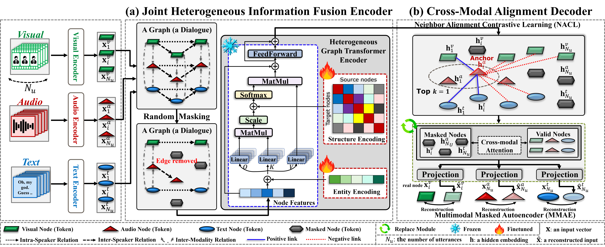

# [Under Review] Cross-Modal Alignment for Robust Multimodal Fusion in Conversational Emotion Recognition

<div align="center">

**Dae Hyeon Kim**<sup>a</sup>, **Dong-Hyuk Lee**<sup>a,b</sup>, **Young-Seok Choi**<sup>a,*</sup>

<sup>a</sup>Department of Electronics and Communications Engineering, Kwangwoon University, Seoul, Republic of Korea
<br>
<sup>b</sup>Medical AI Co., Ltd., Seoul, Republic of Korea

[](https://www.sciencedirect.com/journal/expert-systems-with-applications)
[](LICENSE)

</div>

---

## 📢 News
* **[Aug. 2026]** 🚀 The official code released!
* **[Aug. 2026]** 📝 Our paper **"Cross-Modal Alignment for Robust Multimodal Fusion in Conversational Emotion Recognition"** was submitted to **Expert Systems with Applications** on **August 11, 2026** and is currently **under review**.

---

## 📝 Abstract

As artificial intelligence moves toward empathetic interaction, understanding emotion in conversation has become essential for affective human-computer interaction. In conversation, emotion is conveyed through heterogeneous facial, vocal, and linguistic cues shaped by speaker relations and context dynamics, making Multimodal Emotion Recognition in Conversation (MERC) a challenging problem. Although recent MERC studies have advanced contextual aggregation and multimodal fusion, explicit alignment of heterogeneous modality representations remains underexplored. Consequently, cross-modal embeddings remain distributionally inconsistent, exacerbating modality gap and modality collapse, reducing robustness to missing modalities, and increasing vulnerability to domain shift.

To address this issue, we propose a self-supervised heterogeneous graph representation learning framework that combines a multimodal masked autoencoder (**MMAE**) with Neighbor Alignment Contrastive Learning (**NACL**), a contrastive objective for cross-modal neighborhood alignment. Under a strict cross-dataset transfer setting, experiments show that explicit neighbor alignment improves representation quality and MERC performance, while MMAE and NACL provide complementary benefits. Crucially, we demonstrate that explicit geometric alignment acts as a structural regularizer that mitigates unimodal over-reliance, thereby facilitating a more balanced integration of complementary modalities. These results support cross-modal neighborhood alignment as an effective objective for multimodal representation learning in MERC.

**Framework at a glance.** Each dialogue is modeled as a heterogeneous graph with one node per modality (audio / text / visual) per utterance, connected by intra-speaker, inter-speaker, and inter-modality relations. A unified Heterogeneous Graph Transformer encoder (Graphormer-style) encodes it via Entity Encoding (position, speaker, modality, degree embeddings) and Structure Encoding (shortest-path spatial bias and edge-relation attribute bias). The encoder is pretrained with `L_pretrain = L_mse (MMAE) + λ_con · L_con (NACL)`; for transfer, the decoder is discarded and a linear-fusion classifier is fine-tuned with `L_sup + λ_con · L_con`, i.e., NACL also serves as an auxiliary alignment regularizer.

<table border="0">
  <tr>
    <td align="center">
      
      <br>
      <em>Figure 1: Overall Architecture</em>
    </td>
  </tr>
</table>

---

## 🗂️ Repository Structure

```
.
├── main_crossdataset.py        # Stage 1: SSL pretraining on source (MELD) -> Stage 2: fine-tuning on target (IEMOCAP)
├── main_intradataset.py        # Train-from-scratch or pretrain+finetune on a single dataset (MELD / IEMOCAP)
├── config/
│   ├── meld_pretrain.yaml         # MELD SSL pretraining (MMAE + NACL) — 4-way transfer setting
│   ├── meld_pretrain_6way.yaml    # MELD SSL pretraining — 6-way transfer setting (mask 0.7, k 3, tau 0.7)
│   ├── meld_pretrain_scratch.yaml # Stage-1 config for MELD from-scratch (4-layer encoder)
│   ├── iemocap_pretrain.yaml      # IEMOCAP intra-dataset pretraining
│   ├── iemocap_4.yaml             # IEMOCAP 4-way fine-tuning / evaluation
│   ├── iemocap.yaml               # IEMOCAP 6-way fine-tuning / evaluation
│   └── meld.yaml                  # MELD intra-dataset (from-scratch) training
├── preprocessing/              # Data schemas and split scripts (see preprocessing/README.md)
├── data/                       # Dataset loaders; feature pickles are NOT shipped (see Data Preparation)
├── graphdata/                  # Heterogeneous graph construction + Floyd-Warshall spatial encoding
├── models/
│   ├── Coach.py                # Trainer (pretraining, fine-tuning, evaluation, checkpointing)
│   ├── Optim.py                # Optimizer / LR scheduler wrapper
│   └── emotionheart/           # HGT encoder (Graphormer-style), MMAE decoder, NACL loss, fine-tune wrapper
├── utils.py
└── requirements.txt
```

Datasets (`data/`), checkpoints (`model_checkpoints/`), and experiment outputs (`save/`, `log/`) are not part of the repository and are created or supplied locally.

---

## ⚙️ Environment

- Python 3.9
- PyTorch 2.7.1 + CUDA (tested with CUDA 12.x)
- fairseq 0.12.2 (required by the Graphormer-based encoder)

```bash
pip install "pip<24.1"   # fairseq 0.12.2 -> omegaconf<2.1 wheels carry legacy metadata rejected by pip >= 24.1
pip install -r requirements.txt
```

The paper's experiments were run on Ubuntu 22.04.3 with 3× NVIDIA RTX 3090 GPUs. A single GPU is sufficient to run the code (`device` in the configs, or `--device` on the command line).

---

## 📁 Data Preparation

Features must be prepared from the official [IEMOCAP](https://sail.usc.edu/iemocap/) and [MELD](https://affective-meld.github.io/) releases; the per-utterance features follow the standard MERC feature extraction used in prior work (e.g., COGMEN / MMGCN-style features). Place the pickles as follows:

| File | Format |
| --- | --- |
| `data/iemocap/data_iemocap.pkl` | dict `{train, dev, test}` of dialogues; per utterance: audio 100-d (openSMILE), text 768-d (SBERT), visual 512-d; 6-way labels |
| `data/iemocap_4/data_iemocap_4.pkl` | same layout, 4-way labels (hap/sad/neu/ang) |
| `data/meld/MELD_features_raw1.pkl` | 10-element list: videoIDs, speakers, labels, text 600-d, audio 300-d, visual 342-d, sentences, train/dev/test ids |
| `data/meld/data_meld.pkl` | same layout, with the paper's split indices |

See `preprocessing/README.md` for the exact schemas and the split tooling (`iemocap_split.py` reproduces the fixed 108/12/31 dialogue split; `meld_split.py` searches for a balanced MELD split).

On the first run, the main scripts build heterogeneous graph datasets (including Floyd-Warshall shortest-path spatial encodings) and cache them as `data/<dataset>/graph_*set.pkl`. This can take a while and the caches are large; subsequent runs load them directly.

---

## 🚀 Training

```bash
# Cross-dataset transfer: MELD pretraining -> IEMOCAP 4-way fine-tuning (main result)
python main_crossdataset.py --pretrain_dataset meld --finetune_dataset iemocap_4

# Cross-dataset transfer: MELD pretraining -> IEMOCAP 6-way fine-tuning
python main_crossdataset.py --pretrain_dataset meld --finetune_dataset iemocap \
    --pretrain_config config/meld_pretrain_6way.yaml

# MELD from scratch (supervised + NACL regularizer; 4-layer encoder from the stage-1 config)
python main_intradataset.py --dataset meld --pretrain_config config/meld_pretrain_scratch.yaml
```

The encoder architecture is always taken from the stage-1 (`*_pretrain`) config — including from-scratch runs, where stage 1 is skipped but still supplies the encoder definition.

Stage behavior is controlled by the config files — `config/<dataset>_pretrain.yaml` for stage 1 and `config/<dataset>.yaml` for stage 2:

| Key | Stage | Effect |
| --- | --- | --- |
| `from_begin` | pretrain | `true`: run self-supervised pretraining; `false`: reuse the saved pretrained checkpoint |
| `do_finetune` | finetune | `true`: run supervised fine-tuning on the target dataset |
| `from_scratch` | finetune | `true`: skip pretraining and train the encoder from random initialization |
| `unimodal_inference` | finetune | `true`: missing-modality inference with the saved fine-tuned model (see Evaluation) |
| `freeze_prefixes` | finetune | Parameter-name prefixes frozen during fine-tuning; the 6-way transfer config freezes the 2nd encoder block (`encoder.graph_encoder.layers.1`), as in the paper; 4-way uses full fine-tuning (`[]`) |

Checkpoints are written to `model_checkpoints/<pretrain>_<target>/pretrain_atv_best_model.pt` (stage 1) and `model_checkpoints/<pretrain>_<target>/finetune_atv_best_model.pt` (stage 2), e.g. `model_checkpoints/meld_iemocap_4/`. Loss curves and metrics are saved under `save/analysis/`.

---

## 🔎 Evaluation

Evaluate a saved fine-tuned checkpoint on the test set:

```bash
python main_crossdataset.py --finetune_dataset iemocap_4 --eval_only
python main_crossdataset.py --finetune_dataset iemocap --eval_only
python main_intradataset.py --dataset meld --eval_only
```

**Missing-modality inference.** To evaluate the full-modality fine-tuned model when a modality is unavailable at test time, set `do_finetune: false` and `unimodal_inference: true` in the target config (`config/iemocap_4.yaml` etc.), and select the kept subset with `--modalities`:

```bash
# e.g. audio + text only (visual missing)
python main_crossdataset.py --finetune_dataset iemocap_4 --modalities at
```

Any subset of `{a, t, v}` is supported (`a`, `t`, `v`, `at`, `tv`, `av`).

---

## 🕹 Key hyperparameters (also documented in `config/*.yaml`)

| Hyperparameter | MELD: Scratch | MELD: Pretrain for 4-way / 6-way | IEMOCAP 4-way: Scratch / Transfer | IEMOCAP 6-way: Scratch / Transfer |
|---|---:|---:|---:|---:|
| **Architecture** |  |  |  |  |
| Encoder layers | 4 | 2 | 2 | 2 / 2 (2nd block frozen for transfer) |
| Attention heads | 6 | 6 | 6 | 6 |
| Hidden dimension | 384 | 384 | 384 | 384 |
| **Optimization** |  |  |  |  |
| Optimizer | AdamW | AdamW | AdamW | AdamW |
| Learning rate | 1e-4 | 3e-4 | 1e-4 | 1e-4 |
| Weight decay | - | 3e-2 | - | - |
| Batch size | 128 | 128 | 12 | 12 |
| Epochs | 200 | 300 | 100 | 100 |
| LR scheduler | Cosine Annealing | Cosine Annealing | Cosine Annealing | Cosine Annealing |
| Warmup epochs | - | 5 | - | - |
| **Regularization and objectives** |  |  |  |  |
| Dropout rate | 0.3 | 0.1 | 0.3 | 0.3 |
| Node masking ratio | - | 0.5 / 0.7 | - | - |
| NACL neighbors, k | 3 | 7 / 3 | 7 | 3 |
| NACL temperature, tau | 0.7 | 0.1 | 0.1 | 0.7 |
| NACL weight | 0.5 | 1.0 | 0.5 | 0.5 |

The paired values in the MELD pretraining column correspond to the IEMOCAP 4-way / 6-way target settings, respectively. A dash indicates that the option was not used.

---

## 📊 Experimental Results

The experiments use two Multimodal Emotion Recognition in Conversation (MERC) benchmarks:

- **MELD:** used for direct evaluation and as the source dataset for pretraining.
- **IEMOCAP:** evaluated under 4-way and 6-way emotion classification settings, including MELD-to-IEMOCAP transfer.
- **Primary metric:** weighted F1 score (**w.F1**), reported in percent unless otherwise stated.

**Overall experimental summary:**

- **IEMOCAP 4-way:** 84.7 w.F1, outperforming the strongest baseline by 0.2 percentage points.
- **IEMOCAP 6-way:** 71.9 w.F1, matching the strongest baseline.
- **MELD:** 68.8 w.F1, outperforming the strongest baseline by 1.6 percentage points.
- **Objective ablation:** MMAE + NACL achieves the best transfer performance: 84.65 / 71.91 w.F1 on IEMOCAP 4-way / 6-way.
- **Efficiency:** NACL-only retains the same 4.13M parameters as CLIP while improving transfer performance.
- **Alignment:** NACL substantially improves Linear CKA and reduces the between-modal representation gap.
- **Missing modalities:** MMAE + NACL strengthens audio and visual prediction and achieves the best full-modality result.

<br>

<details>
<summary><strong>🔎 Detailed Experimental Results</strong></summary>

<br>

### Main Benchmark Results

**Experiment.** The proposed unified HGT-based framework is compared with representative sequence-based, graph-based, and hybrid MERC models. Both training from scratch and MELD-to-IEMOCAP transfer are evaluated.

<details>
<summary><strong>Performance comparison on IEMOCAP 4-way</strong></summary>

| Method | Year | Architecture | Happy | Sad | Neutral | Angry | **w.F1** |
|---|---:|---|---:|---:|---:|---:|---:|
| SACL-LSTM | 2023 | Sequence | 75.6 | 78.8 | 81.8 | 85.5 | 80.7 |
| MM-DFN | 2022 | Graph | 80.3 | 80.4 | 79.2 | 85.6 | 80.8 |
| M3Net | 2023 | Graph | 80.0 | 85.2 | **84.6** | 81.9 | 83.6 |
| COGMEN | 2022 | Hybrid | 78.8 | 86.8 | **84.6** | **88.0** | 84.5 |
| ga2mif | 2024 | Hybrid | 86.0 | 88.5 | 82.7 | 83.0 | 84.3 |
| MTG-ERC | 2025 | Hybrid | 81.6 | 87.0 | 83.5 | 80.5 | 83.6 |
| Ours (Scratch) | - | Unified | **88.3** | 84.3 | 77.5 | 82.6 | 82.0 |
| **Ours (Transferred)** | - | Unified | 87.2 | **88.8** | 81.2 | 83.1 | **84.7** |

**Finding.** The transferred model achieves the best overall result at **84.7 w.F1**, exceeding the strongest baseline by **0.2 percentage points**.

---

</details>

<br>

**Experiment.** The same comparison is conducted under the more fine-grained 6-way setting, which additionally distinguishes Excited and Frustrated emotions.

<details>
<summary><strong>Performance comparison on IEMOCAP 6-way</strong></summary>

| Method | Year | Architecture | Happy | Sad | Neutral | Angry | Excited | Frustrated | **w.F1** |
|---|---:|---|---:|---:|---:|---:|---:|---:|---:|
| MVN | 2022 | Sequence | 55.8 | 73.3 | 61.9 | 66.0 | 69.5 | 64.2 | 65.4 |
| DIMMN | 2023 | Sequence | 30.2 | 74.2 | 59.0 | 62.7 | 72.5 | 66.6 | 64.1 |
| CAM-ETC | 2026 | Sequence | 57.7 | 82.0 | 70.7 | 69.6 | 80.4 | 67.3 | 70.5 |
| M3Net | 2023 | Graph | 60.9 | 78.8 | 70.1 | 68.1 | 77.1 | 67.0 | 71.1 |
| MKE-IGN | 2024 | Graph | 53.9 | 82.9 | **72.1** | 71.3 | 75.8 | **68.8** | **71.9** |
| AdaIGN | 2024 | Graph | 53.0 | 81.5 | 71.3 | 65.9 | 76.3 | 67.8 | 70.7 |
| MERC-GCN | 2025 | Hybrid | **68.9** | 78.1 | 66.5 | 58.3 | 79.7 | 62.0 | 69.0 |
| DER-GCN | 2025 | Hybrid | 58.8 | 79.8 | 61.5 | **72.1** | 73.3 | 67.8 | 69.4 |
| Ours (Scratch) | - | Unified | 46.2 | 82.0 | 64.6 | 68.2 | **84.4** | 59.7 | 70.4 |
| **Ours (Transferred)** | - | Unified | 50.4 | **85.4** | 64.3 | 71.8 | **84.4** | 59.6 | **71.9** |

**Finding.** The transferred model reaches **71.9 w.F1**, tying the strongest baseline, while obtaining the highest class-wise scores for **Sad (85.4)** and **Excited (84.4)**.

---

</details>

<br>

**Experiment.** The proposed architecture is trained directly on MELD. Following the paper's protocol, the low-frequency Fear and Disgust classes are excluded from this comparison.

<details>
<summary><strong>Performance comparison on MELD</strong></summary>

| Method | Year | Architecture | Neutral | Surprise | Sad | Joy | Angry | **w.F1** |
|---|---:|---|---:|---:|---:|---:|---:|---:|
| MVN | 2022 | Sequence | 76.7 | 53.2 | 21.8 | 53.6 | 42.6 | 59.0 |
| DIMMN | 2023 | Sequence | 76.0 | 46.9 | 4.6 | 52.3 | 47.6 | 58.6 |
| MKE-IGN | 2024 | Graph | 80.0 | 59.8 | 40.1 | 64.0 | 56.1 | 66.6 |
| AdaIGN | 2024 | Graph | 79.8 | 60.5 | 43.7 | 64.5 | **56.2** | 66.8 |
| Graph-Smile | 2025 | Graph | 80.4 | 59.1 | 42.5 | **65.0** | 53.7 | 66.7 |
| DGODE | 2025 | Hybrid | 82.6 | 60.9 | 45.5 | 63.4 | 54.0 | 67.2 |
| BIG-FUSION | 2025 | Hybrid | 80.6 | 60.6 | 41.8 | 64.7 | 55.6 | 67.2 |
| DEDNet | 2025 | Hybrid | 79.2 | 57.3 | 43.0 | 62.5 | 55.2 | 65.8 |
| GPCC | 2026 | Hybrid | 80.4 | 57.9 | **46.3** | 64.1 | 55.3 | 66.9 |
| **Ours (Scratch)** | - | Unified | **85.6** | **66.6** | 38.9 | 61.6 | 54.5 | **68.8** |

**Finding.** The proposed model achieves the best overall result at **68.8 w.F1**, improving over the strongest baseline by **1.6 percentage points**.

---

</details>

<br>

### Ablation Studies

**Experiment.** Entity-level and structure-level encodings are progressively added to measure their contributions under MELD-to-IEMOCAP transfer.

- Entity encodings: Position, Speaker, Modality, and Degree.
- Structure encodings: Spatial and Attribute.

<details>
<summary><strong>Ablation of heterogeneous graph encodings</strong></summary>

| No. | Position | Speaker | Modality | Degree | Spatial | Attribute | **4-way w.F1 (Delta)** | **6-way w.F1 (Delta)** |
|---:|:---:|:---:|:---:|:---:|:---:|:---:|---:|---:|
| 1 | - | - | - | - | - | - | 81.55 (-) | 69.90 (-) |
| 2 | Yes | - | - | - | - | - | 81.72 (+0.17) | 69.86 (-0.04) |
| 3 | Yes | Yes | - | - | - | - | 81.96 (+0.24) | 70.29 (+0.43) |
| 4 | Yes | Yes | Yes | - | - | - | 82.60 (+0.64) | 70.74 (+0.45) |
| 5 | Yes | Yes | Yes | Yes | - | - | 82.73 (+0.13) | 70.81 (+0.07) |
| 6 | Yes | Yes | Yes | Yes | Yes | - | 84.23 (**+1.50**) | 71.48 (**+0.67**) |
| 7 | Yes | Yes | Yes | Yes | Yes | Yes | **84.65 (+0.42)** | **71.91 (+0.43)** |

**Finding.** Spatial encoding provides the largest incremental improvement, showing that explicit relational topology is particularly important for transfer. The complete entity- and structure-aware model performs best in both settings.

---

</details>

<br>

**Experiment.** Different freezing strategies are compared during MELD-to-IEMOCAP transfer to determine how much of the pretrained representation should be retained.

<details>
<summary><strong>Fine-tuning strategies</strong></summary>

| Fine-Tuning Strategy | **IEMOCAP 4-way w.F1** | **IEMOCAP 6-way w.F1** |
|---|---:|---:|
| Backbone Frozen* | 81.70 | 70.46 |
| 1st Layer Frozen | 82.48 | 70.16 |
| 2nd Layer Frozen | 83.65 | **71.91** |
| Full Fine-tuning | **84.65** | 70.99 |

\* In the backbone-frozen setting, only the graph encodings, linear fusion layer, and linear classifier are fine-tuned.

**Finding.** Full fine-tuning is best for the 4-way task, whereas freezing the second encoder layer is best for the more fine-grained 6-way task. The latter benefits from preserving more of the pretrained aligned geometry.

---

</details>

<br>

**Experiment.** NACL and MMAE are compared with supervised-only training and conventional CLIP-style cross-modal contrastive pretraining in both scratch and transfer settings.

<details>
<summary><strong>Ablation of training objectives</strong></summary>

| Setting | Objective / Pretraining Method | **4-way w.F1** | 4-way Avg. ACC | **6-way w.F1** | 6-way Avg. ACC |
|---|---|---:|---:|---:|---:|
| Scratch | Supervised only | 80.99 | 81.02 | 70.18 | 70.08 |
| Scratch | Supervised + NACL | 82.03 | 82.23 | 70.44 | 70.35 |
| Transfer | CLIP | 81.67 | 81.79 | 69.96 | 70.15 |
| Transfer | MMAE only | 83.11 | 83.33 | 70.60 | 70.28 |
| Transfer | **NACL only** | 83.70 | 83.89 | 70.79 | 70.95 |
| Transfer | **MMAE + NACL** | **84.65** | **84.77** | **71.91** | **72.02** |

Key gains in w.F1:

- Supervised -> Supervised + NACL: **+1.04 / +0.26** on 4-way / 6-way.
- CLIP -> NACL-only: **+2.03 / +0.83**.
- MMAE-only -> NACL-only: **+0.59 / +0.19**.
- NACL-only -> MMAE + NACL: **+0.95 / +1.12**.
- CLIP -> MMAE + NACL: **+2.98 / +1.95**.

**Finding.** NACL-only outperforms both CLIP and MMAE-only in the transfer setting. MMAE + NACL performs best overall, supporting the complementary roles of neighborhood alignment and masked cross-modal reconstruction.

---

</details>

<br>

**Experiment.** The analysis tests whether the objectives align audio, text, and visual representations rather than merely improving classification accuracy.

- **Linear CKA (higher is better):** structural similarity between modality representations.
- **Recall@1 (higher is better):** instance-level cross-modal retrieval accuracy.
- **Within-modal L2:** intra-modal representation spread.
- **Between-modal L2 (lower is better):** distance between modality distributions.

<details>
<summary><strong>Cross-modal alignment metrics</strong></summary>

| Dataset | Metric | Input Data | CLIP | MMAE only | NACL only | MMAE + NACL |
|---|---|---:|---:|---:|---:|---:|
| IEMOCAP 4-way | Linear CKA ↑ | 0.11 ± 0.14 | 0.46 ± 0.11 | 0.42 ± 0.08 | 0.77 ± 0.12 | **0.82 ± 0.07** |
| IEMOCAP 4-way | Recall@1 ↑ | 0.01 ± 0.00 | 0.02 ± 0.00 | 0.03 ± 0.00 | 0.06 ± 0.03 | **0.15 ± 0.08** |
| IEMOCAP 4-way | Within-modal L2 ↑* | 9.72 ± 5.73 | 13.49 ± 3.66 | 14.24 ± 3.33 | **18.62 ± 0.31** | 13.48 ± 1.34 |
| IEMOCAP 4-way | Between-modal L2 ↓ | 23.97 ± 0.69 | 22.01 ± 0.96 | 23.09 ± 0.80 | **12.37 ± 2.43** | 13.80 ± 1.57 |
| IEMOCAP 6-way | Linear CKA ↑ | 0.23 ± 0.17 | 0.36 ± 0.20 | 0.43 ± 0.08 | 0.50 ± 0.04 | **0.57 ± 0.02** |
| IEMOCAP 6-way | Recall@1 ↑ | 0.00 ± 0.00 | 0.01 ± 0.00 | 0.00 ± 0.00 | **0.03 ± 0.01** | 0.02 ± 0.00 |
| IEMOCAP 6-way | Within-modal L2 ↑* | 9.77 ± 5.91 | 15.80 ± 2.83 | 16.27 ± 2.13 | **16.36 ± 1.61** | 12.96 ± 1.48 |
| IEMOCAP 6-way | Between-modal L2 ↓ | 24.04 ± 0.22 | 24.13 ± 0.38 | 23.99 ± 0.60 | 21.47 ± 0.22 | **12.68 ± 2.35** |

\* The paper displays an upward arrow for Within-modal L2, while its table note states that lower values indicate compactness. The authors do not interpret this metric as simply "lower is better": an excessively small value, particularly with high variance and a large between-modal gap, may indicate modality collapse.

All values are averaged across modality pairs or across the three modalities, as applicable.

**Main observations:**

- **Distribution consistency:** Linear CKA rises from 0.46 to 0.77 with NACL on 4-way and from 0.36 to 0.50 on 6-way; MMAE + NACL produces the highest CKA in both settings.
- **Modality gap:** NACL-based objectives sharply reduce between-modal L2. The best values are 12.37 for 4-way with NACL-only and 12.68 for 6-way with MMAE + NACL.
- **Anti-collapse behavior:** NACL increases within-modal spread while reducing the between-modal gap, which the paper interprets as alignment without indiscriminate compression.
- **Cross-modal predictability:** MMAE + NACL reaches 0.15 Recall@1 on 4-way. Exact retrieval remains difficult on the finer-grained 6-way label space.

---

</details>

<br>

**Experiment.** Models are pretrained on MELD and transferred to IEMOCAP 4-way using all modalities. At inference time, one or more modalities are removed.

- **A:** Audio
- **T:** Text
- **V:** Visual

<details>
<summary><strong>Missing-modality inference</strong></summary>

| Available Modalities | CLIP | MMAE only | NACL only | **MMAE + NACL** |
|---|---:|---:|---:|---:|
| A | 28.72 | 27.93 | 36.80 | **44.86** |
| T | 50.22 | 54.58 | **60.02** | 54.84 |
| V | 29.63 | 26.19 | 33.07 | **34.71** |
| A + T | 70.31 | 70.43 | 69.55 | **80.60** |
| T + V | 60.77 | 63.94 | **68.09** | 67.23 |
| V + A | 53.07 | 54.25 | 53.93 | **53.95** |
| **A + T + V** | 81.67 | 83.11 | 83.70 | **84.65** |

**Finding.** NACL improves the standalone predictive capability of all three modalities relative to CLIP. MMAE + NACL is strongest for Audio-only, Visual-only, Audio + Text, and full-modality inference.

Text-only performance decreases from 60.02 with NACL-only to 54.84 with MMAE + NACL, while Audio, Visual, Audio + Text, and full-modality performance improve. The paper interprets this pattern as reduced reliance on the dominant text modality and stronger use of complementary audio and visual information.

</details>

</details>

<br>

---

## Citation

```bibtex
@article{kim2026crossmodal,
  title   = {Cross-Modal Alignment for Robust Multimodal Fusion in Conversational Emotion Recognition},
  author  = {Kim, Dae Hyeon and Lee, Dong-Hyuk and Choi, Young-Seok},
  journal = {Expert Systems with Applications},
  note    = {Submitted August 11, 2026; under review},
  year    = {2026}
}
```

## 🙏 Acknowledgments

The graph encoder builds on [Microsoft Graphormer](https://github.com/microsoft/Graphormer) (MIT License) and uses components from [fairseq](https://github.com/facebookresearch/fairseq). We thank the authors of these projects; the corresponding source files retain their original license headers.
